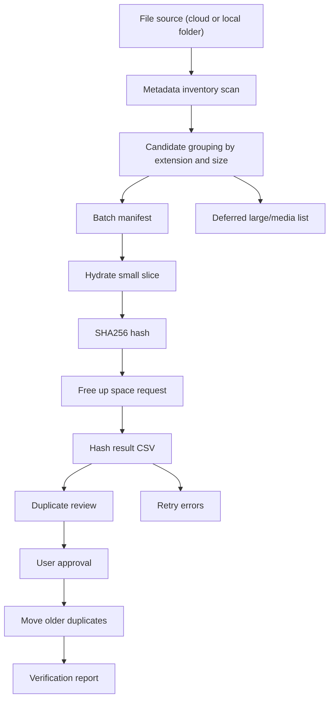

# Architecture

## Components

## Local Scripts

The local workflow uses these main scripts:

- `Invoke-OneDriveLocalHashBatch.ps1`: hydrates a small group of files, hashes them, records results, and requests free-up-space.
- `Run-OneDriveHashBatchOvernight.ps1`: repeatedly runs slices until the manifest is complete, free space is too low, or time limit is reached.
- `Prepare-OneDriveNextBatch.ps1`: prepares the next fast-first manifest and defers large media.
- `OneDriveBatchControl.ps1`: Windows control screen with start, stop, refresh, progress, configuration, and overall progress.
- `OneDrive Batch Control.cmd`: double-click launcher.

Current scripts are OneDrive/Windows focused. Future versions should isolate provider-specific behavior so the same workflow can target other cloud providers or offline folders.

## Data Flow

1. Inventory CSV records metadata only.
2. Manifest CSV lists candidates to hash.
3. Hash result CSV records SHA256 or error.
4. Duplicate review CSV lists older duplicate candidates and suggested destinations.
5. Approved move plan is generated after user approval.
6. Move execution log records each move.
7. Move summary verifies the result.

## Safety Boundaries

- Raw CSVs and logs are local artifacts and should not be committed.
- The GitHub repo documents process and summarized metrics only.
- Moves are limited to older confirmed duplicates.
- Main/newest files are verified after every move.
