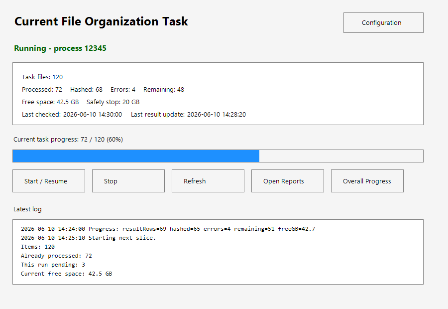

# Control App

The toolkit includes a Windows PowerShell control app for supervising long-running file organization batches.

## Purpose

The app is designed for workflows where files may be cloud-only, large, slow to hydrate, or risky to process all at once. It gives the user a single screen to start, stop, resume, and monitor the active batch.

## Screens

### Main Control Screen

The main screen shows:

- active task name
- running/not-running status
- process ID when running
- processed, hashed, error, and remaining counts
- current free space and configured safety stop
- last checked time
- last result update time
- progress bar
- latest log excerpt
- buttons for start/resume, stop, refresh, reports, overall progress, and configuration

### Configuration

The Configuration screen allows the user to edit safe operating limits without editing scripts:

- minimum free space stop
- retry slice size
- timeout per file
- maximum run time
- fast batch size cap
- fast batch max files
- fast-file size threshold
- next batch name
- active task display name

### Overall Progress

The Overall Progress screen summarizes:

- completed batches
- current retry status
- fast-first strategy
- deferred large-media work
- remaining duplicate-cleanup tasks
- later organization tasks
- preserved safety rules

## Technical Design

The app is implemented with Windows Forms from PowerShell:

- `System.Windows.Forms` provides the UI.
- `System.Drawing` is used for sizing, fonts, and layout.
- Settings are stored in JSON.
- Background work is launched as a separate hidden PowerShell process.
- Closing the app window does not stop the background job.
- The Stop button intentionally stops only the managed background process.

## Resume Behavior

Batch output is written incrementally to CSV. When the user starts/resumes a batch, the runner reads existing output rows and continues from the remaining files.

## Safety Behavior

Before starting, the app checks:

- required scripts exist
- manifest exists
- free space is above the configured stop threshold
- the same task is not already running

Before stopping, the app checks:

- a managed process is running
- the user confirms the stop action

Completed rows already written to CSV are preserved.

## Public Template Notes

The public repository includes a generic app template under `app/`. The original local implementation used machine-specific paths and is not committed.

